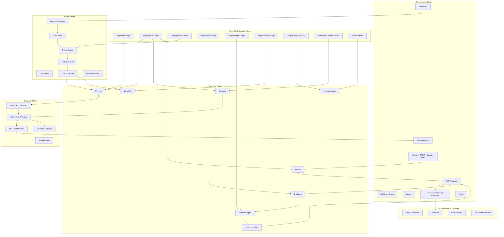

# 00_ForgeRoot_blueprint_設計書

> Canonical repository name: **ForgeRoot**  
> Repository URL: **https://github.com/hiroshitanaka-creator/ForgeRoot**  
> Owner / Creator: **hiroshitanaka-creator**  
> Status: **v1 initial master blueprint**  
> This document is the top-level design source of truth for the initial ForgeRoot build.

## 0. 固定宣言

以下を **ForgeRoot の 00 blueprint 設計書**として固定する。  
ForgeRoot の設計原理は4つだけだ。

1. **Gitが脳である**
2. **`.forge` がゲノム兼記憶である**
3. **PRが唯一の進化搬送路である**
4. **GitHub App + Sandboxが循環器である**

この4原理に反する設計・命名・実装は採用しない。

---

## 1. 一行定義

**ForgeRoot は「AIがGitHub上で作業する仕組み」ではない。  
ForgeRoot は、リポジトリそのものを記憶・評価・変異・系譜を持つ Forge Mind に変える Git-Native 進化基盤である。**

---

## 2. 設計目的

ForgeRoot の目的は以下の4つに集約する。

- GitHub リポジトリを単なるコード置き場ではなく、**選択と進化の場**にする
- 知能の持続層を外部のブラックボックスに置かず、**Git 差分と `.forge`** に押し戻す
- すべての行動変化を **PR とレビュー可能な差分** として表現する
- 将来的に ForgeRoot 自身が ForgeRoot を保守・改善できる自己言及構造へ到達する

---

## 3. 非ゴール

初期版では、以下をやらない。

- default branch への直接書き込み
- 無制限な自己複製
- allowlist なしのネットワーク繁殖
- 外部 DB を唯一の記憶源にする設計
- 単一モデルへの固定ロックイン
- レビュー不能な自己改変
- workflow / permission / ruleset の無承認変更

---

## 4. 核心モデル

ForgeRoot は GitHub の自然な原語彙を進化機構へ変換する。

| GitHub上の要素 | ForgeRoot における意味 |
|---|---|
| Issue | 鍛造タスクの種 |
| Pull Request | 変異の搬送体 |
| Review | 環境圧 / 選択圧 |
| Merge | 選択 |
| Revert | 免疫反応 |
| Fork | 種分化 / 繁殖 |
| Ruleset / Protection | 憲法 |
| `.forge` | ゲノム + 記憶 + 系譜台帳 |

---

## 5. Repo-first 原則

ForgeRoot は以下の三点で既存の agent-first / session-first 設計と分かれる。

- **Session-first ではなく Repo-first**
- **Tool-first ではなく Selection-first**
- **単体自動化ではなく 生態系進化**

ここで主体なのはセッションではなくリポジトリであり、持続する自己は Git 差分としてのみ存在する。

---

## 6. 完成ビジョン

完成した ForgeRoot は、1リポジトリとして次の性質を持つ。

- `mind.forge` を持ち、目的関数・境界条件・承認要件を持つ
- 複数エージェント種が役割分離されている
  - Planner
  - Executor
  - Auditor
  - MemoryKeeper
  - Evaluator
  - MutationEngine
  - EvolutionGuard
  - Networker
- Issue / CI failure / security alert / peer offer を鍛造タスク候補として取り込む
- すべてのタスクを **Plan → Execute → Audit → PR** に分解する
- merge 結果を評価し、score・系譜・記憶に反映する
- 条件を満たした場合に限り、エージェント自身が自分の `.forge` を更新する PR を出す
- ForgeRoot 本体も例外ではなく、自身を自分で保守・進化する

---

## 7. アーキテクチャ概要

### 7.1 レイヤー

1. **Human Governance Layer**  
   人間は全部を手作業で実装するのではなく、憲法設定・高リスク承認・外交境界設定・kill switch を担う。

2. **GitHub Native Surface**  
   Issues / PRs / Reviews / Rulesets / Actions / Forks がそのまま進化の場になる。

3. **ForgeRepo Layer**  
   `.forge` が Forge Mind の自己記述を持ち、`source code + tests + docs` がその身体になる。

4. **Control Plane**  
   GitHub App, webhook ingest, policy engine, rate governor, scheduler, approval router を持つ。

5. **Cognitive Plane**  
   Planner / Executor / Auditor / MemoryKeeper / Evaluator / MutationEngine / EvolutionGuard / Networker に分離する。

6. **Execution Plane**  
   実編集とテストは常に隔離 sandbox / ephemeral worktree 上で実行する。

7. **Derived Runtime State**  
   Postgres / SQLite / Redis / traces は派生状態にすぎず、権威ではない。

### 7.2 全体構造図



---

## 8. 進化ループ

ForgeRoot には5つの主要ループがある。

1. **鍛造ループ**  
   `Plan → Execute → Audit → PR`

2. **選択ループ**  
   `Review / CI / Ruleset / Merge / Revert`

3. **記憶ループ**  
   `Event → Digest → Pack → Recall`

4. **進化ループ**  
   `Evaluate → Mutate → Shadow Eval → Evolution PR`

5. **連邦ループ**  
   `Treaty → Offer → Cross-Repo PR → Adoption`

この5つが揃って初めて、ただの自動化ではなく進化基盤になる。

---

## 9. `.forge` の位置づけ

`.forge` は設定置き場ではない。  
ForgeRoot において `.forge` は以下を担う。

- リポジトリ全体の Forge Mind 定義
- 各 agent 種の自己記述
- policy / constitution / budget / approval の定義
- eval suite
- lineage / species / mutation history
- peer treaty / reputation / network boundary
- curated memory / episodic pack 参照

### 9.1 ディレクトリ基本形

```text
.forge/
  mind.forge
  agents/
  policies/
  evals/
  lineage/
  network/
  packs/
```

### 9.2 更新原則

- 行動変化は必ず PR 経由
- curated memory 更新も原則 PR 経由
- rejected mutation を削除しない
- runtime DB は権威ではない
- Git 履歴・commit trailers・`.forge` packs から再構築可能にする

---

## 10. Source of Truth の優先順位

ForgeRoot では、設計解釈の優先順位を以下で固定する。

1. `00_ForgeRoot_blueprint_設計書.md`
2. `01_単語や命名規則.md`
3. `.forge/mind.forge`
4. `.forge/policies/*.forge`
5. `02_README.md`
6. `03_issue.md`
7. 個別 PR / Issue / 会話ログ

下位が上位と衝突した場合、下位を採用しない。  
衝突時は「矛盾報告」を先に作る。

---

## 11. 役割分離

初期 v1 では、少なくとも以下の役割分離を維持する。

| Role | 主責務 | 禁止事項 |
|---|---|---|
| Planner | 1 task = 1 PR の計画化 | 無制限スコープ化 |
| Executor | bounded edit の実装 | ruleset bypass / workflow 改変 |
| Auditor | 独立監査 | Executor と同一視点への依存 |
| MemoryKeeper | 記憶蒸留・圧縮・再構築 | 権威データの捏造 |
| Evaluator | fitness / trust / risk の採点 | score 改ざん |
| MutationEngine | 改良候補生成 | 自己予算拡大 |
| EvolutionGuard | 危険変異の停止 | 自己無効化 |
| Networker | peer treaty に基づく外交 | 条約なし通信 |

---

## 12. 安全境界

### 12.1 恒久禁止

- default branch direct write
- PAT 中心運用
- workflow / permission の無承認変更
- allowlist なしの peer federation
- self-approval of high-risk mutation
- review 不可能な自己改変
- rate limit を前提にした強引な並列書き込み

### 12.2 承認クラス

| Class | 対象 | 初期ルール |
|---|---|---|
| A | docs / tests / comments / 低リスク refactor | 自動 PR 可、merge 前人間任意 |
| B | 通常コード変更 / 内部 prompt 調整 | PR 必須、1人承認 |
| C | workflow / policy / treaty / spawn 設定 | PR 必須、2段階または code owner 承認 |
| D | branch protection / App権限 / open federation / workflow mutation | 常時手動、自己承認禁止 |

### 12.3 runtime mode

- observe
- propose
- evolve
- federate
- quarantine
- halted

初期状態は **observe または propose** とし、Phase 2 完了前に evolve へ移行しない。

---

## 13. フェーズロードマップ

| Phase | ゴール | 必須成果物 | 完了条件 |
|---|---|---|---|
| Phase 0 | Forge Kernel を確立する | `.forge` spec、parser/kernel、GitHub App、webhook ingest、lab repo、kill switch | seed した repo で Mind / Agent をロードできる |
| Phase 1 | 1 task = 1 PR の鍛造ループを完成させる | Planner / Executor / Auditor、plan DSL、sandbox harness、PR composer | issue から reviewable PR を安全生成できる |
| Phase 2 | merge 結果を記憶と評価へ結びつける | MemoryKeeper、packer、eval DSL、fitness engine | merged PR ごとに memory / score が再現可能 |
| Phase 3 | 限定的な自己進化を解禁する | mutation taxonomy、shadow eval、rollback、EvolutionGuard | 自己改変 PR が安全に評価・採択できる |
| Phase 4 | Forge Mind 間の分散進化を実装する | treaty schema、peer registry、cross-repo PR、arena、reputation | allowlisted peer 3 repo 以上で lineage 交換できる |
| Phase 5 | ForgeRoot 自身を ForgeRoot で運用する | self-host workflows、CLI、extension、governance RFC、chaos suite | ForgeRoot 自身の改善が ForgeRoot の鍛造ループで回る |

---

## 14. 最初の10営業日でやること

最初の10営業日で先にやるべき束は固定する。

### 必須核
- T001 リポジトリ骨格生成
- T003 Forge Constitution 初版
- T004 `.forge` 仕様ドラフト
- T005 canonical parser / kernel
- T006 GitHub App manifest 定義
- T007 webhook ingest server
- T008 event inbox / idempotency

### 最初の鍛造ループ
- T015 issue intake classifier
- T016 plan spec DSL
- T017 Planner runtime
- T018 worktree / branch manager
- T019 Executor sandbox harness
- T023 Auditor runtime
- T024 PR composer
- T025 check suite integration
- T026 approval checkpoint
- T027 rate governor queue
- T028 end-to-end demo PR forge

### 安全の最低ライン
- T014 kill switch / runtime mode
- T040 SARIF bridge
- T041 security gates

これ以外を先にやると、見た目だけ整って中身が崩れる。

---

## 15. 変更原則

この blueprint 自体を変更してよいのは次の場合だけだ。

- 既存の上位原理をより厳密にする
- 明らかな矛盾を修正する
- 実装で再現不能な抽象を具体化する
- 安全境界を明示する
- v1 範囲外の曖昧さを削る

変更時は以下を同時に出す。

1. 変更理由
2. 影響範囲
3. 更新が必要な派生ファイル
4. backward compatibility の有無
5. migration 手順

---

## 16. この doc を使うときのルール

- 仕様の議論をするときは、まずこの文書の節番号を引用する
- 新しい PR / Issue / README / `.forge` を作るときは、この文書と `01_単語や命名規則.md` に適合させる
- 適合しない場合は実装を先に進めず、矛盾報告を起票する
- 歴史的な別名や古い概念名を増やさない

---

## 17. 固定判断

以下を固定判断とする。

- ForgeRoot の主体はリポジトリである
- ForgeRoot の永続知能は Git と `.forge` に置く
- ForgeRoot の行動変化は PR でのみ運ぶ
- ForgeRoot の実行は sandbox で隔離する
- ForgeRoot は段階的に自己進化するが、最初から自律全開にはしない
- ForgeRoot は安全境界の内側でのみ進化させる
