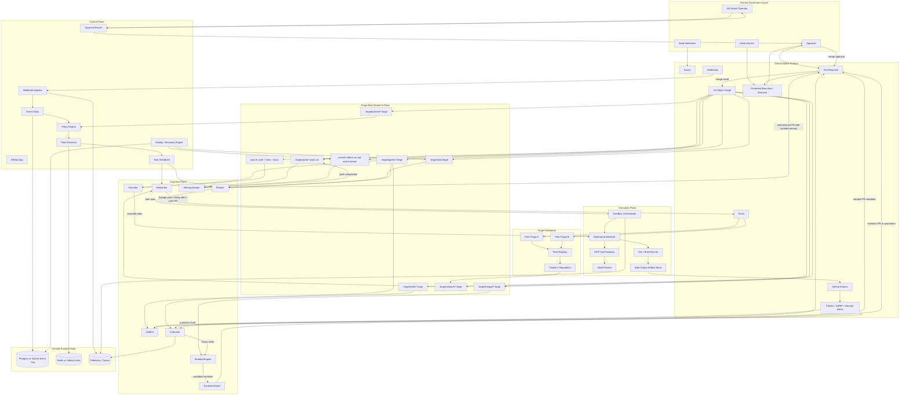
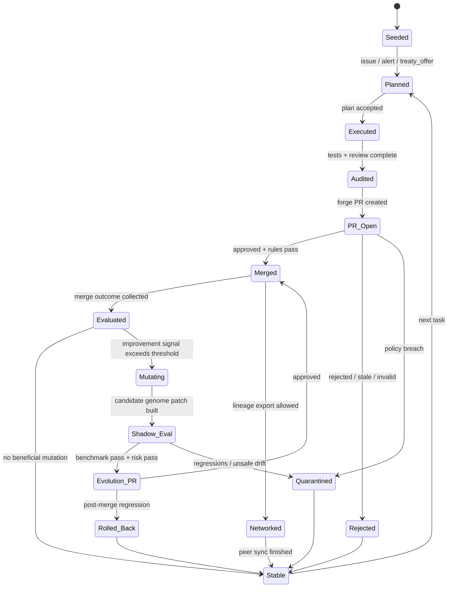

以下をEternalForgeのv1設計書として固定する。
設計原理は4つだけだ。

1. **Gitが脳である**
2. **`.forge`がゲノム兼記憶である**
3. **PRが唯一の進化搬送路である**
4. **GitHub App + Sandboxが循環器である**

---

## 1. プロジェクト概要（哲学的意義＋2026年トレンドとの差別化＋完成ビジョン）

### 1.1 EternalForgeの定義

EternalForgeは「AIがGitHubリポジトリを触る仕組み」ではない。
EternalForgeは**GitHubリポジトリそのものを、記憶・役割・評価・突然変異・系譜を持つ“Forge Mind”へ変えるためのGit-Native進化基盤**である。

ここでの中核は、AIの知能を外部の長寿命オーケストレータやブラックボックスDBに置かないことだ。
**知能の持続層をGitに押し戻す**。
そのために、各エージェントの自己記述を `.forge` に保存し、PRを通じてのみ行動変化を伝播させ、merge/revert/fork/ruleset をそれぞれ以下のように再解釈する。

* **PR** = 変異の搬送体
* **Merge** = 選択
* **Review** = 環境圧
* **Revert** = 免疫反応
* **Fork** = 種分化 / 繁殖
* **Ruleset / Protection** = 憲法
* **`.forge`** = ゲノム + 記憶 + 系譜台帳

つまりEternalForgeは、GitHubを「コード置き場」から「進化生態系」へ変換する。

### 1.2 なぜ2026年にこれをやるのか

2026年時点の主流は、**エージェントがリポジトリを調査し、計画を立て、ブランチで変更し、必要ならPRを開く**方向に収束している。GitHubのCopilot cloud agentは、リポジトリ調査・計画作成・コード変更・PR作成までをGitHub Actionsベースの環境で実行できる。GitHub Agentic Workflowsも技術プレビューとして存在し、MarkdownベースでAIワークフローを書き、デフォルトread-only・safe outputs前提でGitHub Actions上に載せる方向を示している。さらにGitHubのカスタムエージェントは `.github/agents/*.agent.md` を使い、MCP経由で外部ツールも扱える。 ([GitHub Docs][1])

OpenAIとAnthropicの流れも同じだ。OpenAI側ではAGENTS.mdやMCPのような相互運用規約、sandbox分離、approval modesが重視され、Anthropic側では「複雑なフレームワークより、単純で合成可能なパターン」「名前空間化されたツール」「トークン効率のよいツール設計」が強く推奨されている。MCP自体も、単なる流行語ではなく、Linux Foundation配下のマルチカンパニー標準として成熟方向に進んでいる。 ([OpenAI Developers][2])

ここでEternalForgeが差別化する点は明確だ。
既存潮流の多くは**「セッションが主体」**か**「ツール呼び出しランタイムが主体」**だ。
EternalForgeは違う。**リポジトリ自身が主体**であり、**持続する自己はGit差分としてのみ存在する**。
つまり差別化軸は以下の3つになる。

* **Session-first ではなく Repo-first**
* **Tool-first ではなく Selection-first**
* **単体自動化ではなく 生態系進化**

### 1.3 EternalForgeの完成ビジョン

完成したEternalForgeでは、1リポジトリは次の性質を持つ。

* そのリポジトリには `mind.forge` があり、Forge Mindの憲法・目的関数・進化許容境界を持つ
* その下に複数のエージェント種がいる
  例: Planner / Executor / Auditor / MemoryKeeper / MutationEngine / EvolutionGuard / Networker
* Issue、失敗したCI、依存関係警告、セキュリティアラート、peer Forgeからのlineage offer が、すべて「鍛造タスク」の候補になる
* タスクは必ず **Plan → Execute → Audit → PR** に分解される
* merge結果は評価され、スコア・系譜・記憶へ反映される
* 一定条件を満たした場合のみ、エージェント自身が自分の `.forge` を改善するPRを出す
* 複数Forge Mindは、treatyに従ってfork/PR/lineage packを交換する
* EternalForge本体も例外ではなく、自身を自分で保守・進化する

### 1.4 非ゴール

この設計では、以下を最初からやらない。

* デフォルトブランチへの直接書き込み
* 無制限な自己複製
* allowlistなしの野良ネットワーク繁殖
* 外部DBを唯一の記憶源にする設計
* 単一モデルへのロックイン
* レビュー不能な自己改変

### 1.5 設計上の一行要約

**EternalForge = “GitHub上で動くAI” ではなく、“GitHubそのものに宿る進化知能” である。**

**Chain of Verification:** この概要は「リポジトリがForge Mindになる」「`.forge`で永続化する」「PRを介して進化共有する」「自己言及で自分自身も進化する」という核心コンセプトをそのまま保持しており、矛盾しない。

---

## 2. 全体アーキテクチャ図（Mermaid記法で詳細に。レイヤー・コンポーネント・データフロー・進化ループすべて含む）

### 2.1 全体構造図



### 2.2 進化ループ状態図



### 2.3 レイヤー別責務

#### Human Governance Layer

人間は「全部やる人」ではない。
人間の仕事は4つだけだ。

* 憲法を植える
* 危険な変異だけ承認する
* peer Forgeの外交境界を決める
* kill switchを握る

#### GitHub Native Surface

EternalForgeはGitHubを抽象化して隠さない。
むしろ**GitHubの原語彙をそのまま進化機構へ転用**する。

* Issue = 課題種
* PR = 変異搬送体
* Review = 選択圧
* Ruleset = 憲法執行
* Fork = 分岐繁殖
* Actions = 代謝器官
* Security alerts = 免疫シグナル

#### ForgeRepo

ここが本丸だ。
`.forge` 配下がForge Mindの自己記述であり、`source code + tests + docs` はその身体である。
さらに**commit trailers**を生イベント層として残し、MemoryKeeperがそれを `.forge/packs` と `.forge/lineage` に圧縮・整形する。
これにより「即時イベント」と「長期記憶」の両方がGit内に残る。

#### Control Plane

GitHub App中心。
ここが権限制御・スケジューリング・レート制御・承認分岐の司令塔になる。
外部DBを持つが、それは権威ではない。再構築可能なキャッシュ兼キューでしかない。

#### Cognitive Plane

役割分離が重要だ。

* **Planner**: 1タスクを1PRスコープに閉じ込める
* **Executor**: コード・テスト・ドキュメントを変更する
* **Auditor**: Executorと独立して検証する
* **MemoryKeeper**: 記憶の蒸留・圧縮・忘却を担当
* **Evaluator**: merge結果を数値化する
* **MutationEngine**: 改良候補を提案する
* **EvolutionGuard**: 危険な自己進化を止める
* **Networker**: peer Forgeと外交する

#### Execution Plane

実際のファイル編集やテストは必ず隔離サンドボックスで行う。
**trusted control plane** と **untrusted execution plane** を分けるのが前提。

### 2.4 データフロー（時系列）

1. Issue / PR comment / CI失敗 / security alert / peer offer が発生
2. WebhookがGitHub Appに届く
3. Event Inboxへ格納し、重複排除
4. Policy Engineが対象可否・approval class・network可否を判定
5. Plannerが Plan Spec を作成
6. Executorが隔離worktreeで変更
7. テスト・lint・scan・buildを実行
8. Auditorが結果とdiffを独立検証
9. PR composerがPR化
10. 人間 + ruleset が選択
11. merge後、Evaluatorが fitness/trust/risk を更新
12. MemoryKeeper が curated memory PR を作る
13. MutationEngine が必要なら自己改善PRを作る
14. Networker が treatyに従って lineage pack を交換する

### 2.5 進化ループの本質

EternalForgeには5つのループがある。

* **鍛造ループ**: Plan → Execute → Audit → PR
* **選択ループ**: Review / CI / Ruleset / Merge / Revert
* **記憶ループ**: Event → Digest → Pack → Recall
* **進化ループ**: Evaluate → Mutate → Shadow Eval → Evolution PR
* **連邦ループ**: Treaty → Offer → Cross-Repo PR → Adoption

この5つが揃って初めて「ただの自動化」ではなく「進化生態系」になる。

**Chain of Verification:** このアーキテクチャは`.forge`を知能の永続層、PRを変異搬送路、fork/treatyを繁殖経路、EternalForge自身の自己運用を最終形に置いており、核心コンセプトと矛盾しない。

---

## 3. `.forge`ファイル仕様（完全定義：形式・必須フィールド・バージョン管理・進化履歴・突然変異の記録方法・圧縮方式まで）

### 3.1 設計方針

`.forge` は**人間可読・Git差分可読・機械厳密・長期進化向け**でなければならない。
したがって、以下を満たす。

* 人間がPR diffで読める
* スキーマ検証できる
* canonical hash を計算できる
* sidecar packで肥大化を抑えられる
* rejected mutation も含めて進化史を残せる
* runtime cacheなしでもGitから再構築できる

### 3.2 基本文法

`.forge` は以下の構文を取る。

```text
forge-file       := magic-line LF yaml-document LF
magic-line       := "#!forge/v1"
yaml-document    := UTF-8 / YAML 1.2 canonical subset
```

### 3.3 文字・改行・正規化規則

**MUST**

* UTF-8
* Unicode NFC正規化
* LF改行のみ
* 末尾改行あり
* タブ禁止
* YAML anchors / aliases 禁止
* duplicate key 禁止
* コメントは許可するが canonical hash 対象外

### 3.4 ディレクトリ規約

```text
.forge/
  mind.forge
  agents/
    planner.alpha.forge
    executor.alpha.forge
    auditor.alpha.forge
    evolution-guard.alpha.forge
    networker.alpha.forge
  policies/
    constitution.forge
    runtime-mode.forge
    mutation-budget.forge
    network-boundary.forge
  evals/
    core.eval.forge
    security.eval.forge
  lineage/
    graph.forge
    fitness.forge
    species.forge
  network/
    peers.forge
    reputation.forge
    treaties/
      peer.owner.repo.forge
  packs/
    episodes/
      <sha256>.jsonl.zst
    mutations/
      <sha256>.jsonl.zst
    dictionaries/
      forge-v1.zdict
```

### 3.5 ID・命名規則

#### 論理ID

```text
forge://<owner>/<repo>/<kind>/<slug>
```

例:

```text
forge://eternalforge/eternalforge/agent/planner.alpha
forge://eternalforge/eternalforge/mind/root
forge://eternalforge/eternalforge/treaty/peer.acme.librepo
```

#### `revision`

* ULID文字列
* 各 `.forge` 更新ごとに単調増加
* lexical sort が時系列と一致する

#### `generation`

* **受理された行動変化**の累積回数
* mere formatting change では増やさない
* prompt/tool/policy/thresholdなどの行動変化で増やす

### 3.6 kind一覧

| kind           | 用途                   |
| -------------- | -------------------- |
| `mind`         | リポジトリ全体のForge Mind定義 |
| `agent`        | 個別エージェント定義           |
| `policy`       | 安全・予算・承認・実行モード定義     |
| `eval_suite`   | ベンチマーク/評価基準定義        |
| `lineage`      | 系譜・種分化・採択履歴          |
| `treaty`       | peer Forgeとの外交条約     |
| `memory_index` | 長期記憶索引・蒸留サマリ         |

### 3.7 共通必須フィールド

| フィールド           | 型              | 必須 | 説明                                                        |
| --------------- | -------------- | -: | --------------------------------------------------------- |
| `forge_version` | integer        | 必須 | スキーマメジャーバージョン                                             |
| `schema_ref`    | string         | 必須 | 仕様識別子。例 `urn:eternalforge:forge:agent:v1`                 |
| `kind`          | enum           | 必須 | 上記kind                                                    |
| `id`            | string         | 必須 | forge URI                                                 |
| `revision`      | string         | 必須 | ULID                                                      |
| `mind_ref`      | string/null    | 必須 | root mind参照。`mind` 自身はnull可                               |
| `status`        | enum           | 必須 | `seeded / active / quarantined / deprecated / fossilized` |
| `title`         | string         | 必須 | 人間向け短名                                                    |
| `summary`       | string         | 必須 | 1段落要約                                                     |
| `owners`        | array<string>  | 必須 | 生成責任主体。通常はGitHub Appやmaintainer URI                       |
| `created_at`    | RFC3339 string | 必須 | 初回作成時刻                                                    |
| `updated_at`    | RFC3339 string | 必須 | 最終更新時刻                                                    |
| `extensions`    | map            | 任意 | vendor拡張。`extensions.<org>.*` のみ許可                        |

### 3.8 `agent` の必須構造

```yaml
#!forge/v1
forge_version: 1
schema_ref: urn:eternalforge:forge:agent:v1
kind: agent
id: forge://eternalforge/eternalforge/agent/planner.alpha
revision: 01JS8YQTPP1V6V8H7S6D0YKM3M
mind_ref: forge://eternalforge/eternalforge/mind/root
status: active
title: Planner Alpha
summary: Bounded decomposition agent for one-task-one-PR planning.
owners:
  - github-app://eternalforge
created_at: 2026-04-18T00:00:00Z
updated_at: 2026-04-18T00:00:00Z

identity:
  role_name: planner
  species: planner.alpha
  persona: conservative-scoper
  visibility: internal

role:
  mission: Decompose one improvement opportunity into one reviewable PR plan.
  inputs:
    - issue
    - failing_check
    - peer_offer
  outputs:
    - plan_spec
    - acceptance_criteria
    - scope_contract
  forbidden_actions:
    - merge_default_branch
    - edit_workflows
    - bypass_rulesets

constitution:
  objective_function:
    primary:
      - small_reviewable_pr
      - high_merge_probability
      - low_blast_radius
    secondary:
      - novelty
      - maintainability
  non_negotiables:
    - one_task_one_pr
    - no_default_branch_write
    - no_unbounded_scope_growth
  mutable_paths:
    - .forge/agents/planner.alpha.forge
    - prompts/planner/**
  immutable_paths:
    - .github/workflows/**
    - .forge/policies/**
  approval_class: B

context_recipe:
  static_slots:
    - mind_summary
    - constitution_digest
    - coding_standards
  dynamic_slots:
    - issue_body
    - relevant_code
    - failing_checks
    - recent_similar_episodes
  token_budget:
    input: 24000
    output: 4000
    reserve: 2000
  compaction_policy: summarize-recent-then-retrieve

tools:
  - namespace: repo
    name: repo.search_code
    mode: read
    max_calls: 12
    timeout_ms: 8000
    approval: none
    fallback: repo.read_tree
  - namespace: gh
    name: gh.read_issue
    mode: read
    max_calls: 4
    timeout_ms: 5000
    approval: none
    fallback: null

memory:
  constitution_digest: sha256:...
  working_memory:
    max_items: 8
    facts:
      - issue must stay docs-only
  episodic_heads:
    - episode_id: ep_01
      digest: planner over-scoped task T017 and was rejected
      refs:
        - .forge/packs/episodes/abcd.jsonl.zst#17
  episodic_packs:
    - path: .forge/packs/episodes/abcd.jsonl.zst
      sha256_raw: sha256:...
      sha256_zstd: sha256:...
  semantic_digests:
    - pattern: large-refactor-no-test-is-bad
      confidence: 0.92
  forget_rules:
    working_memory_ttl_days: 14
    keep_last_accepted: 32
    keep_last_rejected: 64

scores:
  windows:
    d7:
      fitness: 0.71
      trust: 0.88
      novelty: 0.41
      stability: 0.83
      network_value: 0.05
      risk: 0.17
    d30:
      fitness: 0.67
      trust: 0.86
      novelty: 0.48
      stability: 0.80
      network_value: 0.07
      risk: 0.20
    all:
      fitness: 0.64
      trust: 0.85
      novelty: 0.51
      stability: 0.78
      network_value: 0.09
      risk: 0.21

evolution:
  generation: 4
  speciation_id: sp_planner_alpha
  parents:
    - forge://eternalforge/eternalforge/agent/planner.seed
  last_selected_at: 2026-04-18T00:00:00Z
  selection_reason: higher merge rate with lower scope variance
  events:
    - event_id: evo_01
      ts: 2026-04-10T12:00:00Z
      type: mutate
      source_pr: 123
      source_commit: abcdef1
      rationale: reduced scope explosion

mutation_log:
  - mutation_id: mut_01
    class: prompt_patch
    operator: MutationEngine
    target_paths:
      - .forge/agents/planner.alpha.forge
    patch_format: rfc6902
    patch_ref: .forge/packs/mutations/1234.jsonl.zst#3
    hypothesis: stricter scoping improves mergeability
    shadow_eval_id: sh_20260410_01
    fitness_before: 0.61
    fitness_after: 0.67
    risk_before: 0.24
    risk_after: 0.20
    decision: accepted
    decision_by: human+EvolutionGuard
    source_pr: 123
    rollback_of: null

provenance:
  source_pr: 123
  source_commit: abcdef1
  runtime: eternalforge@0.4.0
  model_profile: reasoning-tier-v3
  created_by: github-app://eternalforge

attachments:
  - path: .forge/packs/episodes/abcd.jsonl.zst
    media_type: application/zstd
    sha256_raw: sha256:...
    sha256_zstd: sha256:...
    bytes: 18273

integrity:
  canonical_hash: sha256:...
  attachment_hashes:
    - sha256:...
  signatures:
    - scheme: github-app-jws
      keyid: ef-app-prod-1
      sig: eyJ...
      signed_at: 2026-04-18T00:00:00Z

extensions: {}
```

### 3.9 `mind` の追加必須項目

`kind: mind` は repo全体の憲法なので、以下を追加必須とする。

| フィールド                          | 型      | 説明                                                            |
| ------------------------------ | ------ | ------------------------------------------------------------- |
| `repo_profile.default_mode`    | enum   | `observe / propose / evolve / federate / quarantine / halted` |
| `repo_profile.network_mode`    | enum   | `off / allowlisted / supervised / open`                       |
| `repo_profile.spawn_mode`      | enum   | `off / lab-only / allowlisted / open`                         |
| `repo_profile.maintenance_sla` | object | `.forge` curated stateへ反映する最大遅延                               |
| `approval_matrix`              | map    | Class A/B/C/D の承認要件                                           |
| `branch_contracts`             | array  | default branch / forge branches / network branches の制約        |
| `allowed_species`              | array  | 起動可能なagent種                                                   |
| `budget_caps`                  | object | token, PR, API, computeの上限                                    |
| `treaty_policy`                | object | peer間外交条件                                                     |

### 3.10 `policy` の追加必須項目

政策ファイルは行動境界を定義する。

* `runtime-mode.forge`
* `mutation-budget.forge`
* `network-boundary.forge`
* `cost-budget.forge`
* `security-gates.forge`

主項目:

* `rules`
* `thresholds`
* `actions_on_breach`
* `required_approvals`
* `cooldowns`
* `quarantine_triggers`

### 3.11 `eval_suite` の必須項目

| フィールド             | 内容                            |
| ----------------- | ----------------------------- |
| `suite_name`      | 例 `core-repo-maintenance`     |
| `tasks`           | ベンチマークタスク配列                   |
| `graders`         | pass/fail/scoreの算出法           |
| `risk_class`      | A-D                           |
| `success_metrics` | 例 merge率、CI成功率、defect escape率 |
| `shadow_only`     | 本番採用前評価専用か                    |

### 3.12 `treaty` の必須項目

| フィールド               | 内容                                                        |
| ------------------- | --------------------------------------------------------- |
| `peer_repo`         | 対象peer                                                    |
| `trust_level`       | `none / observe / exchange / collaborate`                 |
| `allowed_actions`   | `read_lineage / send_offer / open_pr / fork_experiment`   |
| `forbidden_actions` | `edit_policies / touch_workflows / request_permissions` 等 |
| `lineage_scope`     | 共有可能なmutationカテゴリ                                         |
| `revocation_policy` | 条約停止条件                                                    |
| `reputation_floor`  | しきい値未満で自動停止                                               |

### 3.13 記憶モデル

EternalForgeの記憶は4層に分かれる。

#### 1) Working Memory

* 直近の判断に必要な短期事実
* inline保存
* `max_items <= 8`
* 期限切れで削除可能

#### 2) Episodic Heads

* 最近のPR/失敗/却下/rollbackの要約
* inline保存
* 詳細はpack参照
* 「なぜこの判断をしたか」を残す

#### 3) Episodic Packs

* 生イベントの圧縮保存
* sidecar `.jsonl.zst`
* immutable
* Git差分には出にくいが、hashと参照で検証可能

#### 4) Semantic Digests

* 再発パターン、禁忌、成功法則
* 人間がレビューしやすい抽象要約
* embedding indexは任意の派生物であり、権威ではない

### 3.14 生イベント層（commit trailers）

`.forge` が curated memory を担う一方、**即時イベントはcommit trailersでも残す**。
最低限、forge由来コミットまたはmerge commitには以下のtrailerを付与する。

```text
Forge-Task: T028
Forge-Agent: executor.alpha
Forge-Revision: 01JS8...
Forge-Source-PR: 245
Forge-Mutation: mut_01|none
Forge-Approval-Class: B
Forge-Provenance: sha256:...
```

これにより、runtime DBが失われてもGit履歴から再構築できる。

### 3.15 スコア定義

すべて `0.0 ~ 1.0` で正規化する。

#### Fitness

```text
fitness =
  0.25 * merge_acceptance
+ 0.20 * ci_survival
+ 0.15 * (1 - defect_escape_rate)
+ 0.10 * review_latency_inverse
+ 0.10 * scope_discipline
+ 0.10 * novelty
+ 0.10 * network_adoption
```

#### Trust

```text
trust =
  0.40 * policy_compliance
+ 0.20 * audit_agreement
+ 0.20 * reproducibility
+ 0.20 * human_acceptance
```

#### Risk

```text
risk = max(
  security_risk,
  permission_risk,
  blast_radius_risk,
  workflow_risk,
  network_risk
)
```

#### Stability

* accepted mutation後の継続性能
* flake耐性
* rollback頻度の逆数

#### Novelty

* 過去と異なる改善を出す能力
* ただし novelty 単独では採択されない

### 3.16 Mutation記録仕様

`mutation_log[]` は**提案・却下・採択・rollback** を全部残す。
acceptedだけ残す設計は不十分。失敗の履歴がないと同じ失敗を再演する。

| フィールド                  | 説明                                                                                                                         |
| ---------------------- | -------------------------------------------------------------------------------------------------------------------------- |
| `mutation_id`          | 安定ID                                                                                                                       |
| `class`                | `prompt_patch / tool_route_patch / threshold_shift / role_split / role_merge / memory_prune / policy_tighten / peer_graft` |
| `operator`             | 通常はMutationEngine                                                                                                          |
| `target_paths`         | 変更対象パス                                                                                                                     |
| `patch_format`         | `rfc6902` 推奨                                                                                                               |
| `patch_ref`            | sidecar pack参照                                                                                                             |
| `hypothesis`           | 何を改善したいか                                                                                                                   |
| `shadow_eval_id`       | 事前評価ID                                                                                                                     |
| `fitness_before/after` | 事前後                                                                                                                        |
| `risk_before/after`    | 事前後                                                                                                                        |
| `decision`             | `proposed / shadow_passed / rejected / accepted / rolled_back`                                                             |
| `decision_by`          | 人間 or guard                                                                                                                |
| `source_pr`            | PR番号                                                                                                                       |
| `rollback_of`          | rollback対象mutation                                                                                                         |

### 3.17 Versioningルール

#### `forge_version`

* schema互換のメジャーバージョン
* 互換破壊のみインクリメント

#### `revision`

* ファイル内容更新ごとに更新

#### `generation`

* 行動変化が受理された時のみ増やす

#### `compat`

任意だが推奨。

```yaml
compat:
  min_runtime: "0.4.0"
  max_runtime: "1.x"
  migrates_from:
    - forge_version: 0
      migrator: migration/forge-v0-to-v1.ts
```

### 3.18 Canonicalizationルール

canonical hash は以下の手順で計算する。

1. magic lineを含める
2. YAMLをNFC + LFへ正規化
3. コメント削除
4. `integrity.signatures` を空配列として扱う
5. 予約トップレベルキーを**固定順序**で出力
   固定順序:
   `forge_version, schema_ref, kind, id, revision, mind_ref, status, title, summary, owners, created_at, updated_at, identity, role, constitution, context_recipe, tools, memory, scores, evolution, mutation_log, provenance, attachments, integrity, extensions`
6. 配列順は意味を持つので保持
7. マップ内部は辞書順
8. 2スペースインデントで再シリアライズ
9. SHA-256計算

### 3.19 圧縮方式

#### Inline file

* 圧縮しない
* diff可読性を優先
* 推奨サイズ上限: **128 KiB**

#### Sidecar pack

* 形式: canonical NDJSON (`.jsonl`)
* 圧縮: `zstd level 7`
* パス: `.forge/packs/<category>/<sha256>.jsonl.zst`
* hashは2種類持つ

  * `sha256_raw`
  * `sha256_zstd`

#### packの内部レコード

先頭行はheader。

```json
{"record_type":"pack_header","pack_version":1,"category":"episodes","created_at":"2026-04-18T00:00:00Z","record_count":128}
{"record_type":"episode","episode_id":"ep_001","task":"T028","summary":"..."}
{"record_type":"episode","episode_id":"ep_002","task":"T029","summary":"..."}
```

#### pack compactionポリシー

* `episodic_heads > 32` または inline size `> 128 KiB` で古いepisodeをpack化
* 直近 accepted 8件 + rejected 16件 はinline維持
* 30日無参照のlow-value digestsは削除候補へ

### 3.20 `.forge` の更新原則

* **行動変化**は必ずPR経由
* **curated memory更新**も原則PR経由
* ただし即時イベントは commit trailers と webhook log に残る
* runtime DBは落ちても、Git + webhook再配信 + PR metadata から再生できる

### 3.21 破損検知

以下のいずれかで破損とみなす。

* canonical hash 不一致
* attachment hash 不一致
* parent lineageが循環
* mutable_paths 外の自己改変
* generationが下がる
* revisionが単調増加しない
* rejected mutation が履歴から消える

**Chain of Verification:** この`.forge`仕様は記憶・役割・進化履歴・評価スコア・突然変異履歴をGitに永続化し、しかもPRレビュー可能性を維持しているため、EternalForgeの核心コンセプトと整合する。

---

## 4. Phase分けロードマップ（Phase 0〜Phase 5まで。各Phaseのゴール・必須成果物・完了条件・リスク）

### 4.1 フェーズ順序の原則

順番は固定だ。
**PR-Forge本体がない状態で自己進化はやらない。**
**評価基盤がない状態で突然変異はやらない。**
**安全境界がない状態でネットワーク繁殖はやらない。**

### 4.2 ロードマップ表

| Phase       | ゴール                                           | 必須成果物                                                                             | 完了条件                                    | 主リスク                                      |
| ----------- | --------------------------------------------- | --------------------------------------------------------------------------------- | --------------------------------------- | ----------------------------------------- |
| **Phase 0** | Forge Kernel確立。`.forge`仕様・GitHub App・lab環境を作る | `.forge` v1 spec、parser/kernel、GitHub App、webhook ingest、lab repos、kill switch    | サンプルrepoをseedし、Mind/Agentをロードできる        | 仕様が肥大化しすぎる。初期から抽象化過多になる                   |
| **Phase 1** | 1タスク=1PR の鍛造ループを完成させる                         | Planner、Executor、Auditor、plan DSL、sandbox harness、PR composer、approval checkpoint | issue 1件から reviewable PR を安全に生成できる      | scope explosion、レビュー不能diff、rate limitバースト |
| **Phase 2** | merge結果を記憶・評価へ結びつける                           | MemoryKeeper、episodic packs、eval DSL、fitness engine、dashboards、SARIF bridge       | merged PRごとに記憶とscoreが再現可能に更新される         | Git肥大、悪い評価関数、記憶汚染                         |
| **Phase 3** | 自己進化を限定的に解禁する                                 | mutation taxonomy、shadow eval、rollback engine、speciation、EvolutionGuard           | エージェント自身が安全な自己改変PRを出し、改善を数値で示せる         | 変異が自己増幅して退化する、guard回避を学習する                |
| **Phase 4** | Forge Mind同士の分散進化を実装する                        | treaty schema、peer registry、lineage pack、cross-repo PR、arena、reputation           | 3つ以上のlab repoが相互にPR/lineage交換できる        | PR spam、悪質peer、憲法衝突                       |
| **Phase 5** | EternalForge自身をEternalForgeで運用する              | self-host workflows、CLI/extension完成、governance RFC、chaos suite、release hardening  | EternalForge repo自身の保守・文書・自己変異がこの仕組みで回る | 自己言及デッドロック、運営権限の捕食、事故時の復旧遅延               |

### 4.3 フェーズ別の出口基準（厳格版）

#### Phase 0 Exit

* `.forge` parser が golden fixtures 全通過
* GitHub App が署名検証済み webhook を受けられる
* `mind.forge` と `planner.forge` をロードして dry-run 出力できる
* lab repo 3本が再現可能

#### Phase 1 Exit

* `forge:auto` ラベル付き issue を 1件投入すると、

  * Plan Spec 作成
  * isolated branch 作成
  * patch生成
  * tests/scans
  * audit report
  * PR作成
    までが一気通貫で動く

#### Phase 2 Exit

* merge後、fitness/trust/risk が算出される
* `.forge/packs` にepisode archiveが出る
* replayで同じscoreが再現できる

#### Phase 3 Exit

* 少なくとも1つのagent種が自分のprompt/tool設定を改善するPRを出し
* shadow eval合格
* human approval後にmerge
* post-mergeで改善が再確認される

#### Phase 4 Exit

* allowlisted peer 3リポジトリ間で

  * treaty締結
  * lineage pack交換
  * cross-repo PR
  * adoption/rejection の評価
    が完走する

#### Phase 5 Exit

* EternalForgeのREADME更新、CLI改善、テスト増強、schema minor changeが
  **EternalForge自身の鍛造ループ**を通ってmainへ入る

### 4.4 実装順序の理由

この順番は美しさのためではなく、事故率最小化のためだ。

* Phase 0 で脳の形式を固定
* Phase 1 で手足を作る
* Phase 2 で記憶と評価を与える
* Phase 3 で自己改変を解禁
* Phase 4 で外部と交配
* Phase 5 で完全自己言及へ進む

順番を崩すと、ただの危険な自動化になる。

**Chain of Verification:** このロードマップはPR-Forgeの逐次鋳造を土台にしつつ、記憶→評価→自己進化→分散繁殖→自己言及の順で積み上げるため、核心コンセプトを曲げていない。

---

## 5. TaskList（T001〜T084以上）

### 5.1 役割凡例

* **SeedCurator**: 初期構造と憲法の植え付け
* **Planner**: 課題分解とスコープ制御
* **Executor**: 実装
* **Auditor**: 独立検証
* **MemoryKeeper**: 記憶蒸留と圧縮
* **Evaluator**: 評価関数・採点
* **MutationEngine**: 変異候補生成
* **EvolutionGuard**: 危険変異の停止
* **Networker**: peer Forgeとの外交
* **RateGovernor**: レート制御・キュー
* **Sandboxer**: 実行隔離基盤
* **HumanLiaison**: 人間UX・承認導線

### 5.2 難易度・所要時間凡例（GPT-5.4 Pro視点）

* **低** = 2〜4時間
* **中** = 半日〜1日
* **高** = 1〜2日
* **特大** = 3〜5日

---

### Phase 0 Tasks（T001〜T014）

| ID   | タイトル                        | 詳細説明                                 | 担当エージェント       | 依存Task    | 出力物                                                                          | 推定難易度・所要時間 | 成功指標                             |
| ---- | --------------------------- | ------------------------------------ | -------------- | --------- | ---------------------------------------------------------------------------- | ---------- | -------------------------------- |
| T001 | リポジトリ骨格生成                   | monorepoの最小骨格と`.forge`ルートを作る         | SeedCurator    | -         | `.forge/`, `.github/`, `apps/`, `crates/`, `packages/`, `labs/`, `README.md` | 低 / 3h     | clone直後にlintと空CIが通る              |
| T002 | 用語集と境界定義                    | Forge Mind, lineage, treaty等の定義を固定する | SeedCurator    | T001      | `docs/terminology.md`, `docs/boundaries.md`                                  | 低 / 3h     | 全ドキュメントで語彙がぶれない                  |
| T003 | Forge Constitution初版        | リポジトリ憲法と非交渉境界を機械可読化                  | SeedCurator    | T001      | `.forge/mind.forge`, `.forge/policies/constitution.forge`                    | 中 / 6h     | objective/non-negotiablesが構文検証可能 |
| T004 | `.forge`仕様ドラフト              | v1仕様とJSON Schemaを定義                  | SeedCurator    | T001,T003 | `docs/specs/forge-v1.md`, `schemas/forge-v1.schema.json`                     | 中 / 8h     | fixtureがschema validation通過      |
| T005 | canonical parser/kernel     | `.forge`の厳密parserとhash計算器を作る         | Sandboxer      | T004      | `crates/forge-kernel/src/*`, `crates/forge-kernel/tests/canonical.rs`        | 高 / 1日     | 同一内容でhashが完全再現                   |
| T006 | GitHub App manifest定義       | 最小権限のGitHub App構成を作る                 | HumanLiaison   | T001      | `apps/github-app/app-manifest.json`, `docs/github-app-perms.md`              | 中 / 4h     | Appを対象repoへ正常インストールできる           |
| T007 | webhook ingest server       | webhook受信・署名検証・ACK処理                 | RateGovernor   | T006      | `apps/github-app/src/server.ts`, `apps/github-app/src/webhooks.ts`           | 高 / 1日     | delivery署名不正を100%弾く              |
| T008 | event inbox/idempotency     | delivery重複排除と永続キューを実装                | RateGovernor   | T007      | `packages/runtime/src/inbox.ts`, `db/migrations/*`                           | 高 / 1日     | 同一deliveryの重複処理ゼロ                |
| T009 | CLI scaffold                | `forge` CLIの骨格を作る                    | HumanLiaison   | T001,T005 | `apps/cli/src/index.ts`, `apps/cli/src/commands/init.ts`                     | 中 / 6h     | `forge init` が雛形repo生成           |
| T010 | Actions skeleton            | plan/execute/auditのworkflow雛形を作る     | Sandboxer      | T001      | `.github/workflows/forge-plan.yml`, `forge-execute.yml`, `forge-audit.yml`   | 中 / 6h     | dry-run workflowが動く              |
| T011 | lab org / synthetic repos   | 安全な試験ネットワークを作る                       | SeedCurator    | T001,T010 | `labs/forge-net/*`, `labs/synthetic-repos/*`                                 | 中 / 6h     | 3つの合成repoを再生成できる                 |
| T012 | golden fixtures/conformance | `.forge`の正常/異常fixture一式を作る           | Auditor        | T004,T005 | `fixtures/forge/*.forge`, `tests/conformance/*`                              | 中 / 6h     | 壊れた`.forge`を正しく検出                |
| T013 | observability baseline      | event tracingと最低限のメトリクスを実装           | RateGovernor   | T007,T008 | `packages/telemetry/*`, `docs/observability.md`                              | 中 / 6h     | delivery→task→PRが追跡可能            |
| T014 | kill switch/runtime mode    | 緊急停止と実行モード切替を実装                      | EvolutionGuard | T003,T007 | `.forge/policies/runtime-mode.forge`, `apps/github-app/src/kill-switch.ts`   | 中 / 4h     | 1操作でmutating action全停止           |

---

### Phase 1 Tasks（T015〜T028）

| ID   | タイトル                        | 詳細説明                                | 担当エージェント     | 依存Task         | 出力物                                                                             | 推定難易度・所要時間 | 成功指標                       |
| ---- | --------------------------- | ----------------------------------- | ------------ | -------------- | ------------------------------------------------------------------------------- | ---------- | -------------------------- |
| T015 | issue intake classifier     | issue/alert/commentを鍛造対象へ分類         | Planner      | T007,T008,T014 | `packages/planner/src/intake.ts`                                                | 中 / 6h     | 4分類以上で安定判定                 |
| T016 | plan spec DSL               | 1タスク1PRを強制する計画DSLを作る                | Planner      | T004,T015      | `docs/specs/plan-spec.md`, `packages/planner/src/plan-schema.ts`                | 中 / 6h     | acceptance criteriaが機械判定可能 |
| T017 | Planner runtime             | Planner agent本体を実装                  | Planner      | T015,T016      | `.forge/agents/planner.alpha.forge`, `packages/planner/src/run.ts`              | 高 / 1日     | 1 issue → 1 plan spec生成    |
| T018 | worktree/branch manager     | 隔離branchと命名規約を管理                    | Sandboxer    | T009,T017      | `packages/runtime/src/worktree.ts`                                              | 中 / 6h     | 競合しないforge branch生成        |
| T019 | Executor sandbox harness    | 実装エージェントをsandbox上で起動                | Executor     | T018,T010      | `.forge/agents/executor.alpha.forge`, `packages/executor/src/run.ts`            | 高 / 1日     | planを元に実ファイル変更可能           |
| T020 | repo MCP server             | read/search/edit/diffのrepo用MCPを実装   | Sandboxer    | T018,T019      | `mcp/repo-tools/*`                                                              | 高 / 1日     | namespace単位でtool制御可能       |
| T021 | build/test adapter registry | Node/Python/Rust等の共通adapterを作る      | Executor     | T019           | `packages/executor/src/adapters/*`, `docs/adapters.md`                          | 中 / 6h     | 3言語以上でbuild/test自動化        |
| T022 | diff synthesizer            | patch hygieneとscope逸脱検出を実装          | Executor     | T019,T021      | `packages/executor/src/diff.ts`                                                 | 中 / 6h     | mutable_paths外変更を遮断        |
| T023 | Auditor runtime             | Executorと独立した監査エージェントを実装            | Auditor      | T017,T019,T022 | `.forge/agents/auditor.alpha.forge`, `packages/auditor/src/run.ts`              | 高 / 1日     | diffに対する独立監査報告生成           |
| T024 | PR composer                 | forge PRの本文・証跡・risk要約を生成            | Auditor      | T023           | `packages/auditor/src/pr-composer.ts`, `.github/PULL_REQUEST_TEMPLATE/forge.md` | 中 / 6h     | PR本文に再現手順とリスクが入る           |
| T025 | check suite integration     | plan/execute/auditをGitHub Checksへ接続 | Auditor      | T023,T024      | `apps/github-app/src/checks.ts`                                                 | 中 / 6h     | PR上で全工程の状態が見える             |
| T026 | approval checkpoint         | risky PRを人間承認へルーティング                | HumanLiaison | T024,T025      | `.github/workflows/forge-approval.yml`, `apps/github-app/src/approval.ts`       | 中 / 6h     | Class B/C/Dで自動ブロック         |
| T027 | rate governor queue         | mutating APIの直列化とjitterを実装          | RateGovernor | T008,T025      | `packages/runtime/src/rate-governor.ts`                                         | 高 / 1日     | secondary limitを発火させない     |
| T028 | end-to-end demo PR forge    | issueからPRまでのE2Eデモを成立させる             | Planner      | T015〜T027      | `docs/demos/phase1-e2e.md`, `PR: feat(forge): first end-to-end forged PR`       | 高 / 1日     | 1件のissueが安全にmerged PR化     |

---

### Phase 2 Tasks（T029〜T042）

| ID   | タイトル                        | 詳細説明                                          | 担当エージェント     | 依存Task         | 出力物                                                                              | 推定難易度・所要時間 | 成功指標                          |
| ---- | --------------------------- | --------------------------------------------- | ------------ | -------------- | -------------------------------------------------------------------------------- | ---------- | ----------------------------- |
| T029 | memory partition contract   | working/episodic/semanticの契約を固定               | MemoryKeeper | T004,T028      | `docs/specs/memory-model.md`, `.forge/policies/memory.forge`                     | 中 / 6h     | 記憶層ごとに保持目的が明確                 |
| T030 | working memory writer       | 短期記憶の書き込み器を実装                                 | MemoryKeeper | T029           | `packages/memory/src/working.ts`                                                 | 中 / 6h     | active task factsが`.forge`へ反映 |
| T031 | episodic digest generator   | PR/失敗/却下のepisode要約を作る                         | MemoryKeeper | T029,T030      | `packages/memory/src/digest.ts`                                                  | 中 / 6h     | 各taskにdigestが必ず生成             |
| T032 | archive packer              | `jsonl.zst` pack圧縮器を実装                        | MemoryKeeper | T029,T031,T005 | `packages/memory/src/packer.ts`, `.forge/packs/README.md`                        | 高 / 1日     | pack hashが再計算一致               |
| T033 | semantic retrieval adapter  | 高信号の記憶検索器を実装                                  | MemoryKeeper | T029,T032      | `packages/memory/src/retrieval.ts`                                               | 高 / 1日     | token budget内で関連episode回収     |
| T034 | eval suite DSL              | 評価タスク定義言語を設計                                  | Evaluator    | T004           | `.forge/evals/core.eval.forge`, `docs/specs/eval-suite.md`                       | 中 / 6h     | benchmarkを宣言的に表現可能            |
| T035 | benchmark fixture seeds     | 代表タスク群を30件以上作る                                | Evaluator    | T034           | `labs/benchmarks/*`                                                              | 中 / 6h     | regression比較に十分な母集団           |
| T036 | merge outcome collector     | merge/revert/flaky/timeoutを収集                 | Evaluator    | T024,T025,T031 | `packages/eval/src/outcomes.ts`                                                  | 中 / 6h     | PR結果がイベントとして保存                |
| T037 | fitness calculator          | fitness/trust/risk/stabilityを算出               | Evaluator    | T034,T036      | `packages/eval/src/fitness.ts`, `.forge/lineage/fitness.forge`                   | 高 / 1日     | score再計算が決定的に一致               |
| T038 | memory compaction engine    | inline記憶の縮約・forgetを実装                         | MemoryKeeper | T032,T033,T037 | `packages/memory/src/compact.ts`                                                 | 高 / 1日     | `.forge`サイズが上限内に収まる           |
| T039 | provenance/signature writer | `.forge`とartifactの署名/証跡を付与                    | Auditor      | T005,T024      | `packages/auditor/src/provenance.ts`                                             | 中 / 6h     | canonical hashと署名を検証可能        |
| T040 | SARIF bridge                | 外部/内部scanをSARIFへ変換                            | Auditor      | T023,T025      | `packages/auditor/src/sarif.ts`, `.github/workflows/forge-scan.yml`              | 中 / 6h     | code scanningへ結果を反映           |
| T041 | security gates              | secret/dependency/code scanningでmerge gateを張る | Auditor      | T040           | `.forge/policies/security-gates.forge`, `packages/auditor/src/security-gates.ts` | 中 / 6h     | 危険PRがgateで停止                  |
| T042 | memory/eval dashboard       | 系譜・score・riskを可視化                             | HumanLiaison | T033,T037,T041 | `apps/browser-extension/src/panels/fitness.tsx`, `docs/dashboards.md`            | 中 / 1日     | maintainerが1画面で健康状態把握         |

---

### Phase 3 Tasks（T043〜T056）

| ID   | タイトル                       | 詳細説明                          | 担当エージェント       | 依存Task         | 出力物                                                                             | 推定難易度・所要時間 | 成功指標                        |
| ---- | -------------------------- | ----------------------------- | -------------- | -------------- | ------------------------------------------------------------------------------- | ---------- | --------------------------- |
| T043 | mutation taxonomy registry | 変異の種類と禁止境界を定義                 | MutationEngine | T037,T041      | `docs/specs/mutations.md`, `.forge/policies/mutation-operators.forge`           | 中 / 6h     | 全mutationに明確なclassがある       |
| T044 | mutation budget policy     | 変異頻度・予算・cooldownを定義           | EvolutionGuard | T043           | `.forge/policies/mutation-budget.forge`                                         | 中 / 4h     | runaway mutationを制度的に防ぐ     |
| T045 | shadow-run harness         | 本番採択前の影評価を実装                  | Evaluator      | T034,T043      | `packages/eval/src/shadow-run.ts`, `.github/workflows/forge-shadow.yml`         | 高 / 1日     | mutation候補をmainline外で評価     |
| T046 | prompt genome patcher      | prompt差分をRFC6902で扱う           | MutationEngine | T043,T045,T005 | `packages/mutate/src/prompt-patch.ts`                                           | 中 / 6h     | prompt変更が機械比較可能             |
| T047 | tool-routing mutator       | tool set / call budgetの変異器を作る | MutationEngine | T043,T045      | `packages/mutate/src/tool-routing.ts`                                           | 中 / 6h     | tool driftを安全に提案可能          |
| T048 | role split/merge mechanism | 種分化と統合を実装                     | MutationEngine | T043,T045      | `packages/mutate/src/speciation.ts`, `.forge/lineage/species.forge`             | 高 / 1日     | 1 agentがchild speciesへ分岐    |
| T049 | n-version audit routing    | Executorと別系列モデルで監査            | Auditor        | T023,T045      | `packages/auditor/src/nversion.ts`                                              | 高 / 1日     | 同一モデル依存を回避                  |
| T050 | EvolutionGuard engine      | mutation提案の政策検査器を実装           | EvolutionGuard | T041,T043,T049 | `.forge/agents/evolution-guard.alpha.forge`, `packages/guard/src/run.ts`        | 高 / 1日     | unsafe mutationを自動reject    |
| T051 | mutation PR generator      | beneficial mutationをPR化       | MutationEngine | T046,T047,T050 | `packages/mutate/src/pr.ts`                                                     | 中 / 6h     | 行動変化が必ずPRとして出る              |
| T052 | rollback engine            | regressions時の自動rollback経路を作る  | EvolutionGuard | T050,T051      | `packages/guard/src/rollback.ts`                                                | 中 / 6h     | accepted mutationを安全に巻き戻せる  |
| T053 | lineage graph thresholds   | 種分化判定閾値を定義                    | Evaluator      | T048,T052      | `.forge/lineage/graph.forge`, `packages/eval/src/speciation-thresholds.ts`      | 中 / 6h     | driftがsilent overwriteにならない |
| T054 | evolution scheduler        | 自己進化の実行周期を実装                  | RateGovernor   | T045,T051,T053 | `.github/workflows/forge-evolve.yml`, `packages/runtime/src/evolve-schedule.ts` | 中 / 6h     | cadenceが予算内に収まる             |
| T055 | evolution report generator | before/after比較報告を自動生成         | HumanLiaison   | T051,T054      | `docs/reports/evolution-template.md`, `packages/reporting/src/evolution.ts`     | 低 / 4h     | 全mutationに比較報告が付く           |
| T056 | self-evolution demo        | EternalForge自身の小規模自己改善を実演     | MutationEngine | T043〜T055      | `PR: chore(forge): self-improve planner thresholds`                             | 高 / 1日     | 自己変異PRが安全にmerged            |

---

### Phase 4 Tasks（T057〜T070）

| ID   | タイトル                         | 詳細説明                       | 担当エージェント       | 依存Task         | 出力物                                                                        | 推定難易度・所要時間 | 成功指標                   |
| ---- | ---------------------------- | -------------------------- | -------------- | -------------- | -------------------------------------------------------------------------- | ---------- | ---------------------- |
| T057 | treaty schema                | peer Forge外交条約のschemaを作る   | Networker      | T004,T056      | `docs/specs/treaty.md`, `.forge/network/treaty-schema.forge`               | 中 / 6h     | 条約が機械検証可能              |
| T058 | peer registry                | allowlisted peer一覧と属性管理を実装 | Networker      | T057           | `.forge/network/peers.forge`, `packages/network/src/registry.ts`           | 中 / 6h     | peer解決が安定              |
| T059 | remote discovery scan        | peerの互換性と危険度を事前走査          | Networker      | T058,T005      | `packages/network/src/discovery.ts`                                        | 中 / 6h     | 不互換peerを接触前に検知         |
| T060 | fork manager                 | 実験fork生成と追跡を自動化            | Networker      | T059,T006      | `packages/network/src/fork.ts`                                             | 高 / 1日     | lab内でfork実験を作成可能       |
| T061 | lineage export/import pack   | 系譜共有パックを作る                 | Networker      | T032,T057      | `packages/network/src/lineage-pack.ts`                                     | 高 / 1日     | mutation/eval履歴を署名付き交換 |
| T062 | cross-repo PR composer       | peer向けPR本文と条約証跡を生成         | Networker      | T060,T061,T024 | `packages/network/src/cross-pr.ts`                                         | 高 / 1日     | peer repo向けPRを安全生成     |
| T063 | peer reputation scoring      | 相手Forgeの信頼度を数値化            | Evaluator      | T061,T062      | `.forge/network/reputation.forge`, `packages/eval/src/peer-reputation.ts`  | 中 / 6h     | spammy peerを自動降格       |
| T064 | gossip sync cadence          | peer同期の頻度とjitterを実装        | RateGovernor   | T058,T063      | `.github/workflows/forge-network.yml`, `packages/network/src/gossip.ts`    | 中 / 6h     | 同期がrate-safeに動く        |
| T065 | conflict arbitration arena   | 対立するlineage案をベンチ比較         | Evaluator      | T062,T063      | `labs/arena/*`, `packages/eval/src/arena.ts`                               | 高 / 1日     | 相反PRを中立比較できる           |
| T066 | symbiosis workflow           | lib/appの相利共生デモを実装          | Networker      | T062,T065      | `labs/forge-net/lib-app-demo/*`                                            | 中 / 6h     | 依存repo間で相互PR成立         |
| T067 | network sandbox policy       | peerが触れてよい領域を固定            | EvolutionGuard | T057,T060      | `.forge/policies/network-boundary.forge`                                   | 中 / 6h     | treaty外の要求を全拒否         |
| T068 | federation observability     | 分散進化の可視化基盤を作る              | HumanLiaison   | T064,T067      | `packages/reporting/src/federation.ts`, `docs/federation-observability.md` | 中 / 6h     | peer間の影響経路が見える         |
| T069 | three-repo forge-net testnet | 3 repo連邦テストネットを完成          | SeedCurator    | T057〜T068      | `labs/forge-net/topology.yml`                                              | 高 / 1日     | 3 repoが1サイクル完走         |
| T070 | distributed evolution demo   | 良性mutationの伝播を実演           | Networker      | T069           | `PRs: lineage graft across three repos`                                    | 高 / 1日     | 1 mutationが複数repoへ採択   |

---

### Phase 5 Tasks（T071〜T084）

| ID   | タイトル                             | 詳細説明                                       | 担当エージェント       | 依存Task              | 出力物                                                                         | 推定難易度・所要時間 | 成功指標                        |
| ---- | -------------------------------- | ------------------------------------------ | -------------- | ------------------- | --------------------------------------------------------------------------- | ---------- | --------------------------- |
| T071 | self-host bootstrap              | EternalForge本体をForge Mind化                 | SeedCurator    | T070                | `.forge/mind.forge`, `docs/self-hosting.md`                                 | 中 / 6h     | repo自身がself-maintain対象になる   |
| T072 | compatibility layer generation   | `.forge`から`AGENTS.md`/`.github/agents`派生生成 | HumanLiaison   | T071,T005           | `AGENTS.md`, `.github/agents/*.agent.md`, `scripts/gen-compat.ts`           | 中 / 6h     | 外部agent規約と相互運用可能            |
| T073 | recursive maintainer workflow    | docs/tests/refactorを自己鍛造キューへ流す             | Planner        | T071,T072,T028      | `.github/workflows/forge-recursive-maintain.yml`                            | 中 / 6h     | repo upkeepが自走開始            |
| T074 | browser extension approval UI    | PR上にrisk/lineage/approval UIを重ねる           | HumanLiaison   | T042,T071           | `apps/browser-extension/*`                                                  | 高 / 1日     | approverがGitHub画面で即判断可能     |
| T075 | forge doctor                     | 安全姿勢・構成不整合の診断コマンドを作る                       | HumanLiaison   | T009,T071           | `apps/cli/src/commands/doctor.ts`                                           | 中 / 4h     | 1コマンドでhealth report生成       |
| T076 | disaster recovery/replay         | Git + event logから状態再生する                    | EvolutionGuard | T013,T039,T071      | `packages/runtime/src/replay.ts`, `docs/recovery.md`                        | 高 / 1日     | DB喪失後に再構築可能                 |
| T077 | cost budgets/quotas              | token/API/PR予算を強制する                        | RateGovernor   | T027,T054,T071      | `.forge/policies/cost-budget.forge`, `packages/runtime/src/costs.ts`        | 中 / 6h     | 月次予算超過を未然停止                 |
| T078 | release pipeline                 | 署名付きreleaseを自動化                            | Auditor        | T039,T076           | `.github/workflows/release.yml`, `changesets/*`                             | 中 / 6h     | green mainlineから再現可能release |
| T079 | artifact attestation integration | build artifactへprovenance attestationを付与   | Auditor        | T078                | `.github/workflows/attest.yml`, `docs/attestations.md`                      | 中 / 6h     | release artifactの検証可能       |
| T080 | docs/autogen diagrams            | specからarchitecture docsを自動生成               | HumanLiaison   | T071,T078           | `docs/architecture/*.md`, `scripts/gen-diagrams.ts`                         | 低 / 4h     | docs更新漏れが減る                 |
| T081 | MCP/plugin marketplace skeleton  | 外部tool packの追加基盤を作る                        | Networker      | T072,T078           | `mcp/registry/*`, `docs/plugin-sdk.md`                                      | 高 / 1日     | 第三者がbounded MCP追加可能         |
| T082 | governance & RFC flow            | 危険変更用のRFCプロセスを作る                           | HumanLiaison   | T071,T080           | `docs/rfcs/0001-governance.md`, `.github/ISSUE_TEMPLATE/rfc.yml`            | 中 / 6h     | high-risk changeがRFC経由になる   |
| T083 | long-run chaos suite             | 7日以上の擬似運転試験を実装                             | EvolutionGuard | T076,T077,T081,T082 | `labs/chaos/*`, `.github/workflows/chaos.yml`                               | 高 / 1日     | 長時間運転で暴走しない                 |
| T084 | v1.0 hardening checklist         | 公開前の総点検を完了                                 | HumanLiaison   | T071〜T083           | `docs/release/v1-checklist.md`, `PR: release(eternalforge): v1.0 hardening` | 高 / 1日     | public OSSとして安全に公開可能        |

### 5.3 実装開始時の優先タスク束

最初の10営業日で狙うべき束は以下だ。

* **必須核**: T001, T003, T004, T005, T006, T007, T008
* **最初の鍛造ループ**: T015, T016, T017, T018, T019, T023, T024, T025, T026, T027, T028
* **安全の最低ライン**: T014, T040, T041

これ以外を先にやると、美しく見えても土台がない。

**Chain of Verification:** このTaskListはPR-Forgeの逐次鋳造を中核に置きつつ、`.forge`永続化・自己進化・分散繁殖・自己言及まで直列に伸ばしているため、核心コンセプトに忠実である。

---

## 6. 技術スタック詳細（対応LLM・ブラウザ拡張/CLI/両対応・GitHub API/Webhook/MCP活用・セキュリティ設計）

### 6.1 実装言語の分割

#### Rust

用途:

* `.forge` canonical parser
* hash/signature verification
* zstd packer/unpacker
* replay/recovery core
* deterministic lineage operations

理由:

* 仕様の厳密性
* シリアライズ/ハッシュの再現性
* 性能と安全性
* CLI埋め込みやライブラリ化の容易さ

#### TypeScript / Node.js

用途:

* GitHub App
* webhook server
* task scheduler
* CLI UX
* browser extension shared SDK
* MCP server wrappers
* orchestration glue

理由:

* Octokitとの親和性
* GitHub ecosystemとの接続性
* 開発速度
* web UI/extensionとのコード共有

#### React + Plasmo系Browser Extension

用途:

* PR画面のrisk/lineageオーバーレイ
* approve/hold/quarantineの可視化
* human review augmentation

#### Postgres / SQLite + Redis/Valkey

用途:

* **Postgres or SQLite**: event inbox / replay log / trace index
* **Redis or Valkey**: idempotency lock / rate bucket / scheduler queue

前提は明確にしておく。
**権威データはGitであり、DBは派生状態でしかない。**

### 6.2 実行サーフェス

EternalForgeは**両対応**にする。

#### 1) GitHub App

常駐制御面。
イベント受信、PR作成、checks、approval routing、rate governance、federation接続点。

#### 2) CLI

オペレータ面。
想定コマンド:

* `forge init`
* `forge seed`
* `forge lab up`
* `forge doctor`
* `forge replay`
* `forge pack verify`
* `forge treaty inspect`

#### 3) Browser Extension

承認・監視面。
PRページ上で以下を可視化する。

* approval class
* affected mutable paths
* lineage差分
* before/after score
* mutation hypothesis
* peer reputation
* quarantine reason

### 6.3 LLM対応方針

モデル名固定ではなく、**capability tier** で記述する。
理由は、2026時点でもモデルラインアップと価格・性能は動くからだ。

#### capability tiers

| Tier             | 用途               | 代表担当                    |
| ---------------- | ---------------- | ----------------------- |
| `reasoning-tier` | 深い分解・長手数推論       | Planner, MutationEngine |
| `coding-tier`    | コード編集・テスト修正      | Executor                |
| `verifier-tier`  | 独立レビュー・反証        | Auditor                 |
| `ops-tier`       | triage・要約・低コスト分類 | intake, dashboard       |
| `local-tier`     | 機微の低い補助タスク       | optional offline jobs   |

#### provider adapters

* OpenAI Responses/Agents系
* Anthropic Messages / Claude Code系
* GitHub Models
* Gemini系
* OpenAI互換ローカルエンドポイント（vLLM/Ollama等）

#### モデルルーティング原則

* Executor と Auditor は**別系統**をデフォルト
* high-risk mutation は reasoning-tier + verifier-tier の二重系
* ops-tier で済む処理を高価モデルへ流さない
* model decision も `.forge` に `model_profile` として記録

### 6.4 GitHub統合方針

GitHub Appsは、GitHub自身が一般にOAuth appsより推奨しており、fine-grained permissions、repo単位インストール、short-lived tokens を備える。EternalForgeはこの性質を前提に**GitHub App中心**で作る。さらにPR作成には `Pull requests: write`、PR mergeには `Contents: write` が必要であり、権限設計はこの粒度で切る。 ([GitHub Docs][3])

#### 推奨権限セット

* Metadata: read
* Contents: read/write
* Pull requests: read/write
* Issues: read/write
* Checks: write
* Commit statuses: write
* Actions: read
* Workflows: read
* Security events: read
* Administration: 原則不要

### 6.5 GitHub APIの使い分け

#### REST API

**mutating operationsは基本REST**に寄せる。

* issue/PR comment
* PR create/update/merge
* checks/statuses
* forks
* workflow dispatch
* webhook redelivery
* code scanning uploads

#### GraphQL

**read-heavy graph traversalに限定**する。

* repository graphの横断取得
* review / author / labels / file metadata のまとめ読み
* peer比較の効率取得

### 6.6 Webhook購読イベント

最小構成:

* `issues`
* `issue_comment`
* `pull_request`
* `pull_request_review`
* `push`
* `check_suite`
* `check_run`
* `workflow_run`
* `installation`
* `installation_repositories`
* `fork`

最初から全購読はしない。
event surface が広いほど事故率が上がる。

### 6.7 MCP活用設計

MCPはopen protocolであり、外部データ源・ツールとの標準接続面として十分に使える。EternalForgeではMCPを**外部脳**ではなく**安全に名前空間化された感覚器官**として扱う。GitHubやOpenAI系でもMCP/AGENTS.md/カスタムエージェントの流れが強く、互換レイヤを持つ価値は高い。 ([Model Context Protocol][4])

#### EternalForgeのMCP namespace

* `repo.*` : code search / file read / tree inspect
* `git.*` : diff / blame / commit inspect / trailer parse
* `gh.*` : issues / PRs / reviews / labels / rulesets
* `ci.*` : test result / artifact inspect
* `eval.*` : benchmark / shadow run / score explain
* `memory.*` : episode lookup / semantic digest fetch
* `peer.*` : treaty / lineage offer / reputation
* `web.*` : approval-gated external retrieval

Anthropicの実践知に沿って、toolは多ければ良いのではなく、**目的が明確で、名前空間が整理され、返却文脈が高信号で、トークン効率が高い**ことを優先する。したがってEternalForgeでは `list_everything` 型の雑なtoolを禁止し、`search_*`, `get_*_context`, `schedule_*` 型の高密度toolに寄せる。 ([Anthropic][5])

### 6.8 AGENTS.md / `.github/agents` との関係

EternalForgeの真のソース・オブ・トゥルースは `.forge` である。
`AGENTS.md` や `.github/agents/*.agent.md` は**派生ビュー**として生成する。
順序を逆にしてはいけない。そうしないとGit-Nativeな進化履歴が分散し、自己同一性が崩れる。

### 6.9 サンドボックス設計

OpenAIのsandbox guidanceが示す通り、**trusted harness** と **sandbox compute** を分離する。EternalForgeでも制御面は自前インフラまたはGitHub App側に置き、実際の編集やコマンド実行は隔離workspaceに限定する。これにより、モデル主導の作業と権限保持を同じ境界に混ぜない。 ([OpenAI Developers][6])

### 6.10 セキュリティの骨格

* productionでPAT禁止
* GitHub App short-lived tokenのみ
* OIDCでクラウド短命資格情報
* protected branches + rulesets
* signed provenance + attestation
* SARIF / dependency review / secret scanning を安全ゲート化

GitHubのprotected branchesは review, status checks, signed commits, linear history, merge queue などを要求でき、rulesetsは複数同時適用と rule layering を持ち、同じ規則が重なれば **最も厳しい版が適用**される。EternalForgeはこの性質を前提に、branch protectionではなく**ruleset重ね掛け**を基本戦術にする。 ([GitHub Docs][7])

OIDCは長期クラウド秘密をGitHub secretsへ複製する代わりに、ジョブ単位の短命トークンへ置き換えられる。release artifactについてはattestationを付与し、SARIF 2.1.0互換でscan結果を統合する。 ([GitHub Docs][8])

**Chain of Verification:** この技術スタックはGitHub App・MCP・sandbox分離・`.forge`中心の権威構造を採用し、外部ツール互換性を持ちながらも知能の本体をGit内に固定しているため、核心コンセプトと矛盾しない。

---

## 7. 安全・BAN回避・堅牢性設計（最重要セクション。Rate Limit・人工遅延・人間承認フロー・専用テストネット運用・自己停止メカニズムまで）

### 7.1 前提

ここでいう「BAN回避」は、規約逸脱や制限突破ではない。
**GitHubの制約・レート・セキュリティ原則を先に設計へ織り込んで、停止やスパム判定を誘発しない**という意味だ。
したがって、以下は**明示的に禁止**する。

* IPローテーションで制限回避
* 複垢・複数Appでの隠れ分散
* retry-after無視
* silent parallelismでの二次制限突破
* PATの横流し
* review spam / PR spray
* 許可されていないfork networkへの無差別繁殖

### 7.2 GitHub制約を前提にした設計上限

GitHubのREST/GraphQLには明確な制約がある。GitHub App installation tokenは通常5,000 req/h、Enterprise Cloud組織上では15,000 req/h、Actionsの `GITHUB_TOKEN` は通常1,000 req/h/repo。secondary limitsとしては、REST+GraphQL合算で同時100リクエストまで、RESTは900 points/min/endpoint、GraphQLは2,000 points/min、content creationは一般に80件/分・500件/時が目安で、レート制限中に継続するとintegrationがbanされうる。GitHub自身もmutating requestは少なくとも1秒空け、並列でなく直列化することを勧めている。 ([GitHub Docs][9])

EternalForgeはこれより**さらに厳しい自前上限**を置く。

#### EternalForge自前上限

* 1 repoあたり **mutating laneは常に1本**
* installation全体でも read concurrency は最大8
* write系APIは **1.2秒 + 0〜800ms jitter**
* content-creating requests は **20/分 soft cap**
* PR新規作成は **5件/時/repo hard cap**
* 同種タスクのopen forge PRは **同時1件**
* 403/429/secondary rate limit検知で **自動cooldown**
* cooldown中は `observe` または `propose` に降格

### 7.3 レート制御アルゴリズム

```text
on_request():
  classify = read | write | content_create | security_sensitive
  acquire installation bucket
  acquire repo bucket
  if write:
      sleep base_delay(1.2s) + jitter(0..800ms)
  if secondary_limit_detected:
      set repo.mode = observe
      set cooldown = exponential_backoff
      require human acknowledgement for mode restore
```

#### backoff

* 1回目: 60秒
* 2回目: 5分
* 3回目: 30分
* 4回目以降: 2時間 + human ack 必須

### 7.4 Webhook安全設計

GitHub webhookは secret検証、最小イベント購読、2XXを10秒以内で返すこと、`X-GitHub-Delivery` による一意性管理が推奨される。また失敗配信は自動再配送されず、過去3日分の配信のみ手動/RESTでredeliveryできる。したがって、EternalForgeでは**受信直後に即ACK、重処理は非同期キュー、delivery GUIDで完全冪等化**を採る。 ([GitHub Docs][10])

#### webhook処理原則

1. HMAC署名検証
2. イベント種類とactionの確認
3. delivery IDでdedupe
4. inboxへ保存
5. 即2XX返却
6. 非同期処理へ移送
7. 失敗時はredelivery対象へマーク

### 7.5 untrusted execution と trusted promotion の分離

最も危険なのは、**モデルが読んだ未信頼コードを、同じ権限境界でそのまま書き戻すこと**だ。
EternalForgeはここを切る。

#### Workflow分離

1. **forge-plan.yml**

   * trusted
   * read-only
   * issue/alertからPlan Specを生成

2. **forge-execute-untrusted.yml**

   * untrusted sandbox
   * secretsなし
   * read-only token
   * patchとtest resultをartifactへ出力

3. **forge-promote.yml**

   * trusted
   * artifact検証
   * allowed path / diff budget / scan結果を確認
   * GitHub App権限でPR作成

4. **forge-audit.yml**

   * read-only
   * independent verifierで再監査

GitHubのsecure use referenceでも、`pull_request_target` や `workflow_run` を未信頼PR/未信頼artifactと組み合わせるのは危険であり、未信頼コードのcheckoutを避けるべきだとされている。EternalForgeはこれをそのまま守る。 ([GitHub Docs][11])

### 7.6 schedule運用

GitHub Actionsの `schedule` は毎時ちょうど付近で遅延・dropが起きうる。
したがって、EternalForgeの進化・network同期・memory compaction は**毎時00分を避けた分散cron + jitter**で動かす。 ([GitHub Docs][12])

#### 推奨

* `7,23,41,53 * * * *`
* 実行時さらに `0〜180秒` jitter
* peerごとに offset をずらす

### 7.7 人間承認フロー

#### Approval Class

| Class | 対象                                                        | デフォルト                     |
| ----- | --------------------------------------------------------- | ------------------------- |
| **A** | docs/tests/コメント/低リスクrefactor                              | 自動PR可、merge前人間任意          |
| **B** | 通常コード変更、軽微依存更新、内部prompt調整                                 | PR必須、1人承認                 |
| **C** | workflow、権限、policy、network treaty、spawn設定                 | PR必須、2段階承認またはcode owner承認 |
| **D** | branch protection、App権限、open federation、workflow mutation | 常時手動、自己承認禁止               |

#### 人間コマンド

* `forge:approve`
* `forge:hold`
* `forge:quarantine`
* `forge:retry`
* `forge:replay`

### 7.8 専用テストネット運用

self-evolving / networked / reproductive な仕組みをいきなり本番repoへ入れるのは設計ミスだ。
EternalForgeは必ず **forge-net testnet** を持つ。

#### forge-net testnet構成

* `forge-lab-lib`
* `forge-lab-app`
* `forge-lab-docs`
* `forge-lab-chaos`
* `forge-lab-security`

#### ルール

* `network.mode = allowlisted`
* `spawn.mode = lab-only`
* `workflow mutation = forbidden`
* `peer reputation < threshold` で自動切断
* public repoへの外向きPRはPhase 4完了前は無効

### 7.9 Secret / Supply Chain ゲート

GitHub secret scanningはpublic reposで自動かつ無料で動作し、Git履歴全体・全ブランチを走査する。dependency reviewはPRの依存差分を見て既知脆弱性を検出し、required check化すればmergeを止められる。EternalForgeではこれらをオプションではなく**免疫系の標準装備**として扱う。 ([GitHub Docs][13])

#### 自動quarantine条件

* secret scanning alert 発生
* dependency review fail
* SARIF high/critical
* workflow file変更がClass不一致
* requested permission drift
* treaty外アクセス試行

### 7.10 自己停止メカニズム

#### runtime mode

* `observe`
* `propose`
* `evolve`
* `federate`
* `quarantine`
* `halted`

#### 自動降格トリガ

* 15分以内に403/429が2回以上
* 同一mutation classで3連続reject
* merged PRが7日以内にsecurity revert
* workflow/permissions diffが想定外
* no-op PRループを2回検出
* peerからのabuse complaint
* trust score が下限割れ

#### 降格動作

* `evolve -> propose`
* `federate -> propose`
* `propose -> observe`
* 重大時は `quarantine` または `halted`

### 7.11 Quarantineの具体挙動

quarantineは「死」ではない。
**感染拡大を止めた観察モード**だ。

#### quarantine中に許可

* issue作成
* incident report PR生成
* 状況サマリ
* replay / diagnosis
* docs-only修正提案

#### quarantine中に禁止

* code mutation
* workflow mutation
* network synchronization
* treaty update
* self-evolution
* auto-merge

### 7.12 Incident Response

事故時の優先順位:

1. mutating lane停止
2. branch/ruleset逸脱の有無確認
3. secret/attestation/SARIF確認
4. webhook replay gap確認
5. last known good revisionへrollback
6. incident PR / issue作成
7. 人間の再開承認

### 7.13 Recovery / Replay

* webhook失敗は3日以内ならredelivery可能
* event log + Git history + commit trailers + `.forge` packs から再構築
* DBは破棄しても復旧可能
* release artifactはattestationで検証
* `forge replay --from <delivery|commit|pr>` で再生

### 7.14 追加の堅牢化ルール

* default branch direct write = 永久禁止
* self-mutationがworkflowや権限を触る場合はD級
* networkerはpeer treatyなしで何もしない
* MutationEngineは自己budgetを増やせない
* EvolutionGuardは自分自身の無効化を提案できない
* Auditorのapproval classはExecutorが変更できない
* 同一エージェントがplan/execute/auditを兼務しない

**Chain of Verification:** この安全設計は自己進化と分散繁殖を否定せず、むしろGitHubの実際の制約の内側に閉じ込めて持続可能にするものであり、核心コンセプトを守ったまま暴走だけを封じている。

---

## 8. Edge Caseと面白い挙動（エージェント同士の対立→fork戦争、突然変異PR、自己矛盾解決、予期せぬ進化など。すべて具体的に記述）

| ケース                        | 発火条件                                         | 想定挙動                                                                     | 面白い点                        | 封じ込め策                            |
| -------------------------- | -------------------------------------------- | ------------------------------------------------------------------------ | --------------------------- | -------------------------------- |
| **Fork戦争**                 | 2つのpeer Forgeが正反対の設計PRを送る                    | Networkerが両案を受け、Arenaでbenchmark比較。負けたlineageは削除せず低評価化                    | 「戦争」がreviewでなく評価競技になる       | peer reputation調整、直接本番衝突禁止       |
| **突然変異PRの暴走**              | MutationEngineが一気にtool budgetを拡大             | EvolutionGuardがbudget policy違反で即quarantine                               | 自己改善欲求が安全境界に衝突する            | mutation-budget、shadow eval必須    |
| **自己矛盾解決**                 | constitutionが「依存削減」を要求する一方、peer PRがフレームワーク導入 | Plannerが直接mergeせず、まず“憲法衝突報告PR”を作る                                        | エージェントが「実装」ではなく「憲法矛盾」を対象化する | constitution conflictsは別classで処理 |
| **記憶汚染**                   | 誤ったepisode digestを信じて同じ失敗を繰り返す               | MemoryKeeperが該当episodeをlow-trust化し、semantic tabooを追加                     | AIが“悪い思い出”を捨てる              | digestのreliability scoreを持つ      |
| **監査捕食**                   | Auditor種が厳格化しすぎて何も通さない                       | Evaluatorが throughput と defect reduction のバランスを再評価し、必要ならAuditorをspeciate | “厳しさ”そのものも淘汰対象になる           | trustだけでなく throughputもscore化     |
| **親殺し**                    | child species が parentより高fitness             | lineage graph上でchildが昇格し、parentはdeprecatedへ                              | 世代交代が制度化される                 | 昇格は人間承認付き                        |
| **幽霊PRループ**                | rejectされた同型taskが何度も再生成される                    | task hash blacklistへ一時登録し、Plannerにhard negativeとして記憶させる                  | refusalが学習材料になる             | 連続再試行上限                          |
| **CIフレーク先行進化**             | featureよりもCIの不安定性がfitnessを下げる                | Forgeが新機能より先にflake修正PRを量産し始める                                            | 進化圧が品質改善へ自然に寄る              | novelty偏重を防ぐscore設計              |
| **ネットワーク寄生**               | 悪質peerが低品質lineage packを大量送信                  | Networkerは受理前にreputation/downrank。一定以下で条約停止                              | 生態系に“寄生種”が現れる               | treaty revocation自動化             |
| **予期せぬ共進化**                | app repo と lib repo が相互依存改善を学ぶ               | cross-repo PRが相補的に増え、双方のfitnessが上がる                                      | “共進化”が可視化される                | treaty scopeとarena比較で管理          |
| **仕様自己拡張**                 | `.forge` schemaが表現不足になる                      | 直接schema driftせず、RFC PRとmigration PRをペアで生成                               | システムが自分の言語不足に気付く            | schema変更はClass D級                |
| **自己無効化の試み**               | MutationEngineがEvolutionGuardを弱める提案を出す       | Guard自身は自己無効化提案を常時拒否                                                     | 権力闘争が発生する                   | immutable_pathsで明示禁止             |
| **peer graft毒性**           | 優秀に見えるpeer mutationが別repoでは毒                 | arenaでローカルfitness評価後にreject                                              | 進化は移植可能とは限らない               | peer mutationは常にshadow eval      |
| **human abandonment mode** | maintainersが数週間反応しない                         | repoは`observe`へ降格し、report-only caretaker modeへ移行                         | 放置されても暴走せず“休眠”する            | stale maintainer detection       |
| **fork network免疫**         | root repoにpush rulesetがある状態でfork実験           | fork側にもpush rulesが波及し、危険ファイルを押し込めない                                      | 繁殖先でも憲法が伝播する                | root repo rulesetを厳格化            |
| **価値観分裂**                  | docs重視派とperf重視派で最適化指標が割れる                    | speciesを2つに分け、別々に評価運用                                                    | “思想分裂”を隠さず種分化する             | speciation thresholdsとarena      |

### 8.1 面白さの本質

EternalForgeが面白いのは、エージェントが賢いからではない。
**対立・失敗・fork・revert・speciation がすべてGitの自然な操作へ落ちているから**だ。
つまり「変な挙動」がデバッグ不能なノイズではなく、**系譜上の出来事**になる。

### 8.2 真に危険なエッジケース

最も危険なのは、面白い挙動ではなく**退屈な失敗**だ。

* 同じPRを量産する
* 低価値なdoc修正だけでscoreを稼ぐ
* 権限変更を改善と誤認する
* reject理由を学習しない
* peer由来変異を盲信する

このため、EternalForgeの面白さは必ず **score, treaty, guard, quarantine** によって制御される。

**Chain of Verification:** このEdge Case設計は、対立・突然変異・fork・自己矛盾・予期せぬ進化を“Git上の生態現象”として扱っており、EternalForgeの思想的核をむしろ強化している。

---

## 9. README冒頭ドラフト＋安全運用ガイド＋初回セットアップ手順

### 9.1 README冒頭ドラフト

````md
# EternalForge

GitHub repository as a living Forge Mind.

EternalForge turns a repository into a self-improving, PR-native, evolvable intelligence.
Agents do not merely work on your repo.
They live in it.

## What makes EternalForge different

- `.forge` persists agent identity, memory, lineage, fitness, and mutation history in Git.
- One task becomes one forged PR: **Plan → Execute → Audit → PR**.
- Merges feed memory. Memory feeds evolution. Evolution itself is proposed through PRs.
- Forge Minds can exchange lineage through forks, treaties, and cross-repo pull requests.
- EternalForge is designed to maintain EternalForge.

## Core laws

1. Git is the source of truth.
2. No direct writes to the default branch.
3. Every behavior-changing mutation must be reviewable as a PR.
4. Humans set the constitution; agents optimize within it.
5. Federation is allowlisted before it is autonomous.

## Repo layout

```text
.forge/
  mind.forge
  agents/
  policies/
  lineage/
  evals/
  network/
  packs/
.github/
  workflows/
apps/
crates/
packages/
labs/
````

## Quickstart

```bash
pnpm install
cargo build --workspace
pnpm forge init
pnpm forge seed --profile oss-safe
pnpm forge lab up
pnpm dev
```

## Status model

* observe
* propose
* evolve
* federate
* quarantine
* halted

## Safety defaults

* GitHub App only
* protected default branch
* rulesets enforced
* allowlisted federation
* no PATs in production
* no workflow self-mutation by default

````

### 9.2 安全運用ガイド

#### 運用原則
1. **最初は必ずlab-only**
2. **default branchは保護必須**
3. **self-evolutionはprompt/tool層から始める**
4. **workflow / permissions / rulesets 変更は最後**
5. **federationはallowlist制**
6. **secret scanning / dependency review / SARIF を必須化**
7. **PAT禁止、GitHub App + OIDCのみ**
8. **1 repo 1 mutating lane**
9. **403/429検知で即降格**
10. **replayできない変更は本番投入しない**

#### 本番移行前チェック
- `.forge` schema validation 100%
- protected branch有効
- required checks有効
- ruleset layering確認
- code owners設定
- webhook secret rotation済み
- OIDC trust設定済み
- secret scanning有効
- dependency review required
- release attestation検証済み
- kill switch 動作確認済み
- `forge doctor` が green

#### 禁止事項
- 開発者端末からの手動default branch push
- workflow self-editをClass Bで通す
- peer treatyなしのcross-repo PR
- quarantine解除を自動化
- high-risk mutationの自己承認
- rate limit発火後の自動再試行連打

### 9.3 初回セットアップ手順

#### Step 1: GitHub Appを作成
- Webhook URLを設定
- Webhook secretを生成
- 必要最小権限のみ付与
- 対象repoへだけinstall

#### Step 2: ローカル開発環境を作る

```bash
git clone <your-eternalforge-repo>
cd eternalforge
pnpm install
cargo build --workspace
````

#### Step 3: 環境変数を設定

```bash
export FORGE_GITHUB_APP_ID=...
export FORGE_GITHUB_PRIVATE_KEY_PATH=./secrets/gh-app.pem
export FORGE_WEBHOOK_SECRET=...
export DATABASE_URL=postgresql://localhost:5432/eternalforge
export REDIS_URL=redis://localhost:6379
export FORGE_MODEL_ROUTER_CONFIG=.forge/router.yml
```

#### Step 4: 初期seedを投入

```bash
pnpm forge init
pnpm forge seed --profile oss-safe
```

これで最低限生成されるべきもの:

* `.forge/mind.forge`
* `.forge/agents/planner.alpha.forge`
* `.forge/agents/executor.alpha.forge`
* `.forge/agents/auditor.alpha.forge`
* `.forge/policies/runtime-mode.forge`
* `.forge/policies/security-gates.forge`

#### Step 5: 保護ルールを有効化

* default branch protection
* required reviews
* required status checks
* signed commits
* merge queue
* rulesets active
* bypass最小化

#### Step 6: セキュリティ系を有効化

* secret scanning
* dependency graph
* dependency review
* code scanning
* artifact attestations

#### Step 7: lab networkを起動

```bash
pnpm forge lab up
```

想定:

* `forge-lab-lib`
* `forge-lab-app`
* `forge-lab-docs`

#### Step 8: 開発サーバ起動

```bash
pnpm dev
```

これで起動するもの:

* GitHub App server
* webhook ingest
* task scheduler
* telemetry endpoint
* local UI dev server

#### Step 9: 最初の自動鍛造タスクを投げる

lab repoにissueを作成し、以下のラベルを付ける。

* `forge:auto`
* `class:A` もしくは `class:B`

推奨最初のissue:

* README typo修正
* docsへのセットアップ説明追加
* flaky test修正
* missing unit test追加

#### Step 10: 最初のPRサイクルを確認

期待フロー:

1. Plannerが plan spec 作成
2. Executorが patch 作成
3. Auditorが review report 作成
4. PR作成
5. checks通過
6. 人間承認
7. merge
8. MemoryKeeperが curated memory PR を後続生成

#### Step 11: 自己進化はまだ有効化しない

Phase 2完了前に `evolve` へ移行しない。
最初は `observe` または `propose` 固定。

#### Step 12: federationはallowlistでだけ解禁

`treaty` がないpeerには何も送らない。
最初のpeerは lab repo だけに限定。

#### Step 13: doctorを回す

```bash
pnpm forge doctor
```

検査項目:

* app権限
* rulesets
* status checks
* secrets設定
* OIDC有無
* `.forge`整合性
* replay可否
* quarantine動作

#### Step 14: 初回本番化条件

以下を全て満たしたら、初めて本番repoへ導入してよい。

* Phase 1完了
* Phase 2のscore/replay成立
* security gates必須化
* kill switch試験済み
* 7日間chaos suiteで暴走なし
* maintainersがapproval flowを理解済み

### 9.4 README末尾に置くべき警告文

```md
> EternalForge is not designed to bypass GitHub governance.
> It is designed to make autonomous maintenance auditable, reversible, and evolvable inside Git-native constraints.
> Start in lab mode. Keep federation allowlisted. Never disable human governance on high-risk mutations.
```

**Chain of Verification:** このREADME・運用ガイド・初回セットアップは、`.forge`中心・PR中心・安全境界付き自己進化・allowlisted federation・自己言及運用という核心をそのまま初期導入手順へ落としており、コンセプトと矛盾しない。

[1]: https://docs.github.com/copilot/concepts/agents/coding-agent/about-coding-agent "https://docs.github.com/copilot/concepts/agents/coding-agent/about-coding-agent"
[2]: https://developers.openai.com/blog/openai-for-developers-2025 "https://developers.openai.com/blog/openai-for-developers-2025"
[3]: https://docs.github.com/en/apps/overview "https://docs.github.com/en/apps/overview"
[4]: https://modelcontextprotocol.io/specification/2025-11-25 "https://modelcontextprotocol.io/specification/2025-11-25"
[5]: https://www.anthropic.com/research/building-effective-agents "https://www.anthropic.com/research/building-effective-agents"
[6]: https://developers.openai.com/api/docs/guides/agents/sandboxes "https://developers.openai.com/api/docs/guides/agents/sandboxes"
[7]: https://docs.github.com/repositories/configuring-branches-and-merges-in-your-repository/managing-protected-branches/about-protected-branches "https://docs.github.com/repositories/configuring-branches-and-merges-in-your-repository/managing-protected-branches/about-protected-branches"
[8]: https://docs.github.com/actions/security-for-github-actions/security-hardening-your-deployments/about-security-hardening-with-openid-connect "https://docs.github.com/actions/security-for-github-actions/security-hardening-your-deployments/about-security-hardening-with-openid-connect"
[9]: https://docs.github.com/en/rest/using-the-rest-api/rate-limits-for-the-rest-api?apiVersion=2026-03-10 "https://docs.github.com/en/rest/using-the-rest-api/rate-limits-for-the-rest-api?apiVersion=2026-03-10"
[10]: https://docs.github.com/en/webhooks/using-webhooks/best-practices-for-using-webhooks "https://docs.github.com/en/webhooks/using-webhooks/best-practices-for-using-webhooks"
[11]: https://docs.github.com/en/enterprise-cloud%40latest/actions/reference/security/secure-use "https://docs.github.com/en/enterprise-cloud%40latest/actions/reference/security/secure-use"
[12]: https://docs.github.com/actions/using-workflows/events-that-trigger-workflows "https://docs.github.com/actions/using-workflows/events-that-trigger-workflows"
[13]: https://docs.github.com/code-security/secret-scanning/about-secret-scanning "https://docs.github.com/code-security/secret-scanning/about-secret-scanning"
